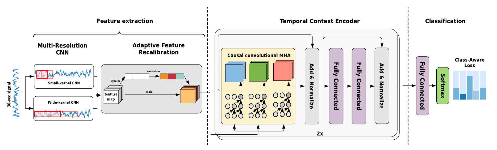

# AttnSleep
### AttnSleep: An Attention-based Deep Learning Approach for Sleep Stage Classification with Single-Channel EEG 
#### *by: Emadeldeen Eldele, Zhenghua Chen, Chengyu Liu, Min Wu, Chee-Keong Kwoh, Xiaoli Li, and Cuntai Guan* 
This work has been accepted for publication in [IEEE Transactions on Neural Systems and Rehabilitation Engineering (TNSRE).](https://ieeexplore.ieee.org/document/9417097)

## :boom::boom: *Update [Sep 2023]:* We received the 3rd Prize in the 2023 IEEE Engineering in Medicine and Biology Prize Paper Award. This prestigious award recognizes the outstanding contributions provided in this work!

## Abstract

Automatic sleep stage classification is of great importance to measure sleep quality. In this paper, we propose a novel attention-based deep learning architecture called AttnSleep to classify sleep stages using single channel EEG signals. This architecture starts with the feature extraction module based on multi-resolution convolutional neural network (MRCNN) and adaptive feature recalibration (AFR). The MRCNN can extract low and high frequency features and the AFR is able to improve the quality of the extracted features by modeling the inter-dependencies between the features. The second module is the temporal context encoder (TCE) that leverages a multi-head attention mechanism to capture the temporal dependencies among the extracted features. Particularly, the multi-head attention deploys causal convolutions to model the temporal relations in the input features. We evaluate the performance of our proposed AttnSleep model using three public datasets. The results show that our AttnSleep outperforms state-of-the-art techniques in terms of different evaluation metrics.


## Requirmenets:
- Intall jq package (for linux)
- Python3.7
- Pytorch=='1.4'
- Numpy
- Sklearn
- Pandas
- openpyxl
- mne=='0.20.7'

## Prepare datasets
> `Update:` The preprocessed datasets are now available [on this Dataverse](https://researchdata.ntu.edu.sg/dataverse/attnSleep)

We used three public datasets in this study:
- [Sleep-EDF-20](https://gist.github.com/emadeldeen24/a22691e36759934e53984289a94cb09b)
- [Sleep-EDF-78](https://physionet.org/content/sleep-edfx/1.0.0/)
- [SHHS dataset](https://sleepdata.org/datasets/shhs)


After downloading the datasets, you can prepare them as follows:
```
cd prepare_datasets
python prepare_physionet.py --data_dir /path/to/PSG/files --output_dir edf_20_npz --select_ch "EEG Fpz-Cz"
python prepare_shhs.py --data_dir /path/to/EDF/files --ann_dir /path/to/Annotation/files --output_dir shhs_npz --select_ch "EEG C4-A1"
```

## Training AttnSleep 
For updating the training parameters, you have to update the `config.json` file.
In this file, you can update:
- The experiment name (Recommended to update this for different experiments)
- The number of GPUs.
- Batch size.
- Number of folds (as we use K-fold cross validation).
- Optimizer type along with its parameters.
- the loss function. (to update this you have to include the new loss function in the [loss.py](./model/loss.py) file).
- the evaluation metrics (also to add more metrics, update the [metrics.py](./model/metric.py) file).
- The number of training epochs.
- The save directory (location of saving the results of experiment)
- The save_period (the interval of saving the checkpoints and best model).
- verbosity of log (0 for less logs, 2 for all logs, 1 in between)


To perform the standard K-fold cross validation, specify the number of folds in `config.json` and run the following:
```
chmod +x batch_train.sh
./batch_train.sh 0 /path/to/npz/files
```
where the first argument represents the GPU id (If you want to use CPU, set the number of gpus to 0 in the config file)

If you want to train only one specific fold (e.g. fold 10), use this command:
```
python train_Kfold_CV.py --device 0 --fold_id 10 --np_data_dir /path/to/npz/files
```
## Results
The log file of each fold is found in the fold directory inside the save_dir.   
The final classification report is found the experiment directory and note that it sums up all the folds results to calculate the metrics.

## Citation
```
@article{emadeldeen_attnSleep,
  author={Eldele, Emadeldeen and Chen, Zhenghua and Liu, Chengyu and Wu, Min and Kwoh, Chee-Keong and Li, Xiaoli and Guan, Cuntai},
  journal={IEEE Transactions on Neural Systems and Rehabilitation Engineering}, 
  title={An Attention-based Deep Learning Approach for Sleep Stage Classification with Single-Channel EEG}, 
  year={2021},
  volume={29},
  pages={809-818},
  doi={10.1109/TNSRE.2021.3076234}
}
```


## Contact
Emadeldeen Eldele   
School of Computer Science and Engineering (SCSE)   
Nanyang Technological University, Singapore   
Email: emad0002{at}e.ntu.edu.sg   
